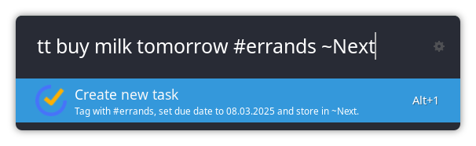

# Ulauncher TickTick

A simple extension that allows to create tasks in [TickTick](https://www.ticktick.com) from within
[Ulauncher](https://ulauncher.io/).



## Setup

To authorize with your TickTick account, go to [developer.ticktick.com](https://developer.ticktick.com/manage) and
select *New App*. Specify some arbitrary *Name* and *App Service URL*. Then set the field *OAuth redirect URL* to

```txt
http://127.0.0.1:8090
```

specifically, where the port needs to be adapted to whatever changes are made to the port in the extension preferences.

Now copy the *Client ID* and *Client secret* to the extension preferences and issue this extension from within
Ulauncher. Click *Retrieve access token* and follow the instructions. You should now be connected to your TickTick
account.

## Usage

Type the keyword (defaults to `tt`) and some string. This string is used as the title of your task. Furthermore, you
can

- specify the target project using the syntax `~YOUR PROJECT NAME`
- add tags using the syntax `#TAG`
- add a due date using the syntax
  - American-style dates `MM/DD[/[YY]YY]`
  - European-style dates `DD.MM.[[YY]YY]`
  - ISO-style dates `YYYY-MM-DD`
  - a relative statement `tod[ay]`, `tom[orrow]` or `next w[ee]k|mon[th]|y[ea]r`
  - or something like `November`, `May 4th` or `Jan 1st 1970`

## Contributing

Contributions of any sorts, pull requests and forks are welcome.

## License

This project is licensed under the terms of the MIT license. See the LICENSE file for details.
